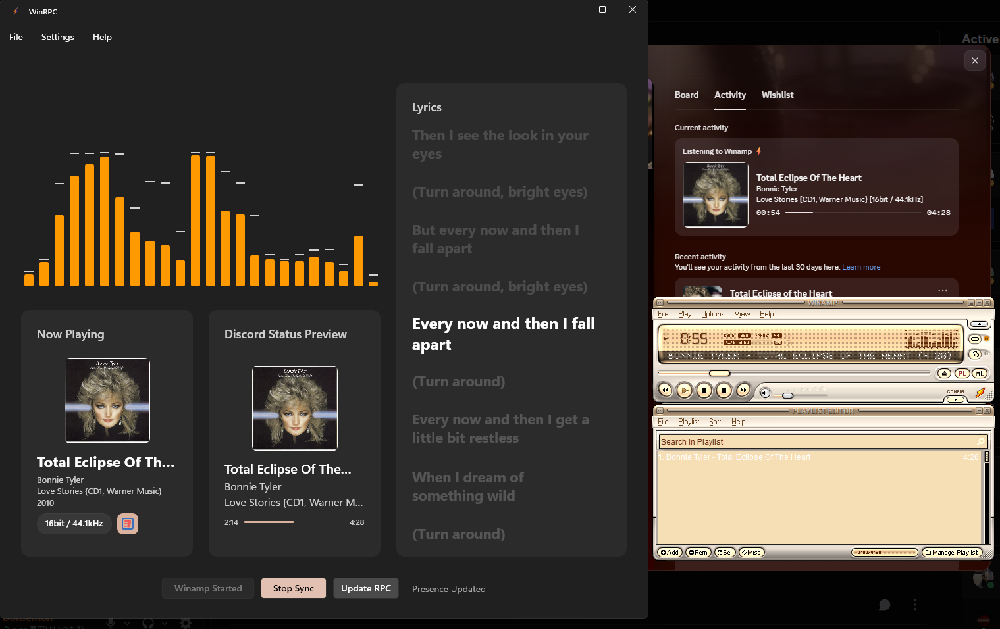

# WinampRPC


A modern, high-performance Discord Rich Presence (RPC) and Last.fm scrobbler plugin for the legendary Winamp media player Out-of-the-box. Built with a blisteringly fast Go backend and a beautiful, fluent WinUI 3 (C# / .NET 8) frontend.

## ✨ Features

- **Discord Rich Presence**: Show off what you're listening to in real-time on your Discord profile.
- **Last.fm Integration**: Automatically fetches high-quality album art for your currently playing tracks.
- **Modern UI**: A sleek, fully responsive WinUI 3 desktop application featuring light/dark mode, Mica backdrops, and fluid animations.
- **Live Lyrics**: Automatically fetches and displays synchronized lyric for the current track. *(Note: Synced lyrics are provided by LRCLIB. If a song's lyrics are occasionally out of sync, it is due to the crowdsourced data provided by the API, I only picked the synced and the duration difference no more than 10s.)*
- **Built-in Visualizer**: Includes a retro-inspired, high-framerate audio visualizer that reacts to the music playing in Winamp.
- **Audio Format Info**: View detailed file metadata (bitrate, sample rate, codec, compression ratio).
- **Lightning Fast Bridge**: The plugin itself is a lightweight C-shared DLL written in Go, meaning zero overhead or lag in Winamp.

## 📸 Screenshot



## 🚀 Installation

1. Go to the [Releases](#) page and download `WinampRPC_Setup.exe`.
2. Run the classic installer.
3. _Optional:_ Leave the "Automatically install visualizer plugin to Winamp" box checked, and the installer will instantly copy the bridge DLL directly into your Winamp folder for you!
4. Launch `WinampRPC.exe` and enjoy!

## 🛠️ Architecture

WinampRPC is split into two powerful components:

1. **The Backend (`plugin/vis_winamprpc.dll`)**: Written in Go. This acts as a standard Winamp Visualizer plugin. It hooks into Winamp's memory, reads the current track metadata, extracts album art, and calculates audio frequencies, then streams it all over a blazing-fast local gRPC/named-pipe connection.
2. **The Frontend (`WinampRPC.exe`)**: Written in C# .NET 8 with WinUI 3. It catches the data streamed by the Go backend and handles the heavy lifting: Discord SDK communication, Last.fm API calls, lyrics fetching, and rendering the beautiful user interface.

## ⚙️ Building from Source

### Prerequisites

- [Go 1.22+](https://go.dev/)
- [.NET 8 SDK](https://dotnet.microsoft.com/)
- [Inno Setup](https://jrsoftware.org/isdl.php) (For building the installer)

### Compilation

1. **Build the Go Backend:**
   ```bash
   cd backend
   go build -buildmode=c-shared -o winamp_bridge.dll
   ```
2. **Build the C# Frontend:**
   ```bash
   cd frontend/WinampRPC
   dotnet publish -c Release -r win-x64 --self-contained true -p:PublishSingleFile=false
   ```
3. **Build the Installer:**
   Open `installer.iss` in the project root using Inno Setup and click **Compile**.

## 📄 License

This project is licensed under the MIT License - see the [LICENSE.txt](LICENSE.txt) file for details.

---

_Spare a dime please :D_
[PayPal](https://paypal.me/Ashitanosora) | [Ko-fi](https://ko-fi.com/cattosann)
